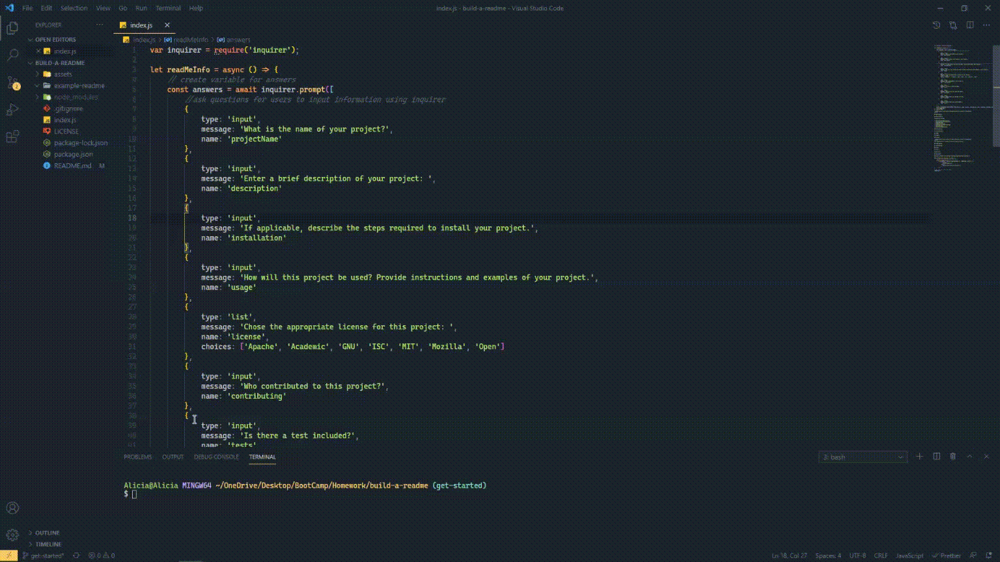

# build-a-readme

 

## Description

A node.js application that uses user input from inquirer to populate a README.md file for user repository. The README.md file is created in the example-readme folder and can be found 

## How To

- Install dependencies from package.json
- Enter node index.js in terminal
- Answer the prompts
- When all prompts are answered, it will generate a README.md in the example-readme folder

### Usage Video

### License

MIT License
